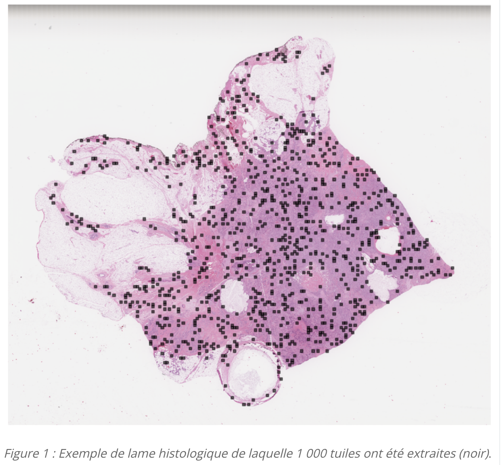
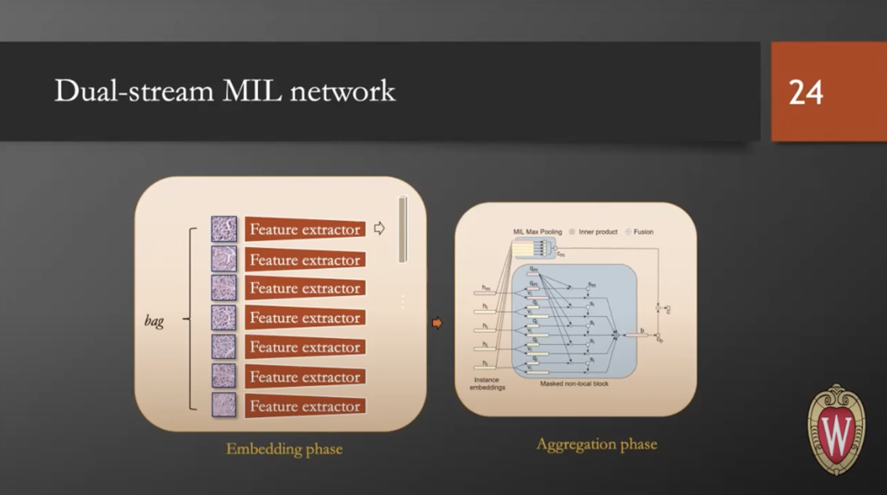
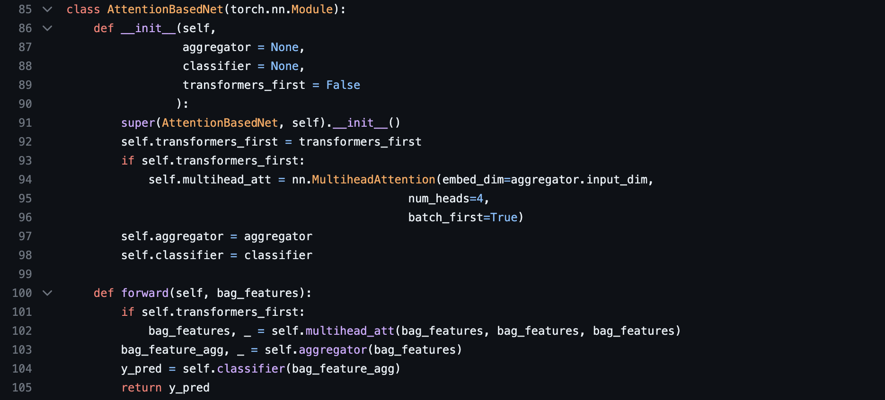
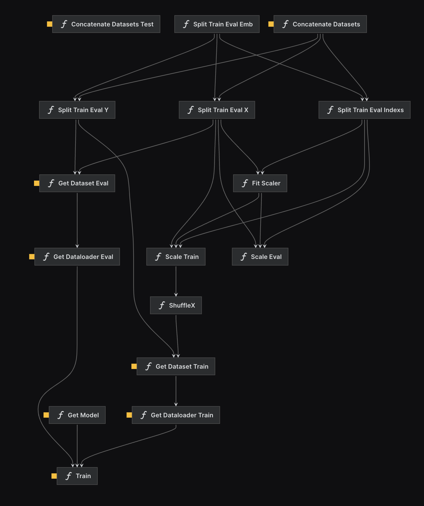

# PIK3CA mutation prediction

## Overview

This repository aims to present the way I program, what libraries and frameworks do I use, how I declare my variables, classes, functions, what details of comments do I add, how I use git ... .Note that this code was created using kedro framework (see [Kedro documentation](https://kedro.readthedocs.io)) which allows an automation of pipelines execution, reproducability as well as uniformity in projects organization (folders, parameters registration, code implementation ...). It is a framework that I use on a daily basis. 
However, when I don't use it, I always try to respect the good coding practices it includes (data management, logging, configs, pipelines ...)


**Note: all the code I produced is stored within 3 pipelines folders (data_engineering, data_processing, training) that can be found in src/owking_project/pipelines**

## The PIK3CA challenge

This is a challenge that focused on Multiple Instance Learning prediction to detect PIK3CA mutation in breast cancer. The project was created by Owkin and ENS-ParisSaclay. More details can be found here: https://challengedata.ens.fr/challenges/98. 
In few words, the goal of the challenge is to create a classifier that is able to assess if a Whole Slide Image (WSI) comes from a tissue with PIK3CA mutation or not. The difficulty lies in the fact that WSI are too big to be seen as a whole (> 100k x 100k pixels), therefore, only 1000 tiles of size 224x224 are extracted with the global label of the associated WSI (see fig1, the black spot are the tiles). While only some tiles may present unhealthy cells, the classifier needs to assess the global label based on the 1000 tiles per image. 




The proposed work here aims to compare simple instance neural net classifier (on which top k predictions are used to assess the global label) with the Dual-Stream MIL network explained here https://www.youtube.com/watch?v=ZPe94q8wxPQ. Note that the downstream top k predictions model for the simple classifier is not present in this repository as the project was not completed. 

Dual Stream MIL network is composed of two parts: 
- A feature extractor, which embeds image. This model is usually trained using contrastive learning 
- An aggregator, which embeds a bag of instance. This part uses self attention network to identify what instances contribute the most to the embedding (and therefore, to output class)



For educational purpose, I first started by creating a simple aggregator based on self attention modules. This aggregator can use simple attention blocks or gated attention blocks. The model is called AttentionBasedNet and can be found in src/owking_project/pipeines/training/models/AttentionBased.py. Here is a piece of code of the model:




The kedro project contains three pipelines located in src/pipelines
- data_processing: Preprocess data by concatenating data from all patients folders. Run `kedro run --pipeline=data_processing`
- data_engineering: Data engineer data to create train and eval data. Also scale and shuffle data. Run `kedro run --pipeline=data_engineering`
- training: Train models using declared train and eval dataloaders. Run `kedro run --pipeline=training`

The pipelines can be visualized using kedro viz. Here is the visualization of the functions and datasets used in training the AttentionBasedNet model, from processing to training. 


All config parameters are found in conf/base/parameters and data location in conf/base/catalog.yml

## Dependecies

All dependencies are declared in `src/requirements.txt` for `pip` installation.

To install them, create a new conda environnement `conda create -n ENV_NAME`, activate it and then run:

```
pip install -r src/requirements.txt
```
